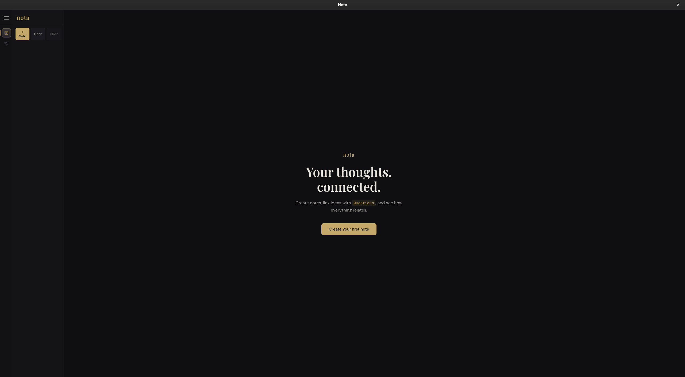

# Nota

Nota is a local-first note app for writing connected notes, organizing them into nested groups, and visualizing relationships in a graph view.

## Features

- Create, edit, delete, and organize notes.
- Create nested groups and drag notes or groups between them.
- Mention notes and groups from the editor with `@`.
- Preview notes with rendered LaTeX using KaTeX.
- Preview fenced code blocks with Prism.js syntax highlighting.
- Explore notes and groups in a graph view.
- Zoom and pan the graph canvas.
- Open a directory as a group, with Markdown files imported as notes and subdirectories imported as subgroups.
- Save the opened group back to Markdown files and subgroup directories with Ctrl/Cmd + S.
- Toggle the sidebar with the hamburger button or `Tab`.

## Preview Syntax

Inline math:

```text
$E = mc^2$
```

Display math:

```text
$$
\int_0^1 x^2 dx
$$
```

Code blocks:

````text
```ts
const message = "hello";
console.log(message);
```
````

Supported code language aliases include `js`, `ts`, `tsx`, `python`/`py`, `bash`/`sh`, `css`, `json`,`rust`,`c`,`haskell`,`agda` and `markdown`.

## Graph View

The graph view represents:

- notes as smaller circles
- groups as larger circles
- nested groups as smaller circles inside parent group circles
- notes inside their group when they belong to a group without explicitly mentioning it
- mention relationships as arrowed links

Controls:

- Use `+`, `-`, and `Reset` to control zoom.
- Use Ctrl/Command + wheel to zoom.
- Hold the middle mouse button and drag to pan.
- Click a note node to open it.

## Getting Started

Install dependencies:

```bash
npm install
```

Run the desktop app in development mode:

```bash
npm run dev
```

Run only the browser development server:

```bash
npm run dev:web
```

Build for production:

```bash
npm run build
```

Run the production build in Electron:

```bash
npm run build
npm start
```

Preview the production build:

```bash
npm run preview
```

## Nix Shell

This repository includes `shell.nix` with Node.js and npm. If you use Nix, enter the shell first:

```bash
nix-shell
```

The shell also provides Electron through Nix and points the npm Electron wrapper at that binary. Then run the normal npm commands.

## Tech Stack

- React
- TypeScript
- Vite
- Electron
- Zustand
- KaTeX
- Prism.js

## Data Storage

Notes, groups, and UI state are persisted in browser local storage under the Zustand storage key `nota-storage`. In the desktop app, an opened directory is treated as a group, subdirectories are treated as subgroups, and Ctrl/Cmd + S writes note content back as Markdown as-is.
